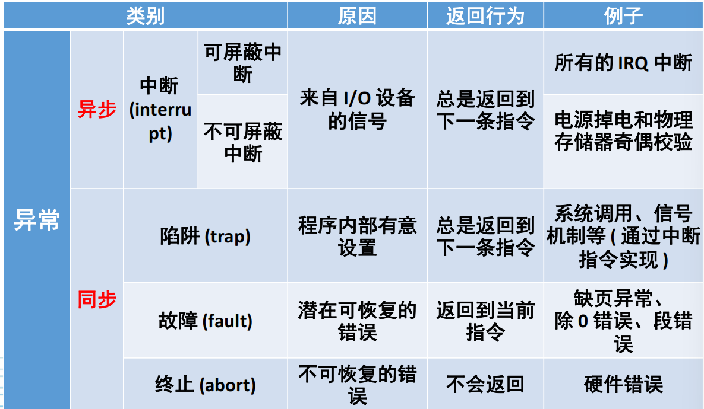

# 引言

## OS历史发展

### 1、批处理系统

把用户提交的作业成批送入计算机，由作业调度程序自动选择作业运行，在没有人工参与的情况下，顺序执行一系列的程序。

* 联机批处理系统：作业的输入/输出由CPU来处理
* 脱机批处理系统：输入/输出脱离主机控制

缺点：只能同时运行一道程序

### 2、多道程序系统

将多个程序同时放入内存中，交替在CPU中运行，共享系统软件、硬件资源，当某一道程序因为I/O请求而暂停运行时，CPU就去运行另一道程序。

* 宏观上并行
* 微观上串行

缺点：程序争抢硬件资源

### 分时系统

将CPU处理时间分割为多个时间片，将时间片分给不同程序，达到多个程序“同时”运行的效果。

### 分布式OS

多台机器统一管理形成单一系统，相比网络操作系统，对用户和应用高度 **透明** 。

* 数据透明：用户无需了解文件存储位置
* 执行透明：用户无需关心程序运行位置
* 保护透明：统一的身份管理和安全机制

## 操作系统基本实现机制

### 异常

#### 中断

主要由I/O设备、处理器时钟或定时器等硬件产生，可以被启用或禁用。

#### 陷阱

是用户进程中某一特定指令执行的结果，在相同条件下，异常可以重现。例如内存访问错误、调试指令以及被零除。

* 系统调用也视作同步异常，或trap。
* 软件和硬件都可以产生异常和中断。
* 陷阱(trap)帧：完整的线程描述表的子集，用于现场保护。
* 陷阱处理程序处理少量事件，多数转交给其他的内核或执行体模块处理。

### 用户态和内核态

当用户程序中存在系统调用的时候，就会进入内核态，由OS内核完成内核态下的作业。

当系统调用的时候会产生异常，属于同步异常（陷阱）。

## OS功能

* 处理机管理
* 存储器管理
* 设备管理
* 文件管理
* 作业控制

重点是处理机管理和存储器管理（期中前）。

### 处理机管理

**核心任务** ：进程管理和线程管理

* 程序：静态的实体
* 进程：执行中的程序
* 进程的调度：创建、挂起、激活
* 进程间的通信：同步、互斥、死锁
* 线程：线程被设计成进程的一个执行路径，同一个进程中的线程共享进程的资源

### 存储器管理

**核心任务** ：管理缓存、主存、磁盘等所形成的多级存储架构，为多道程序的并发提供良好的环境
