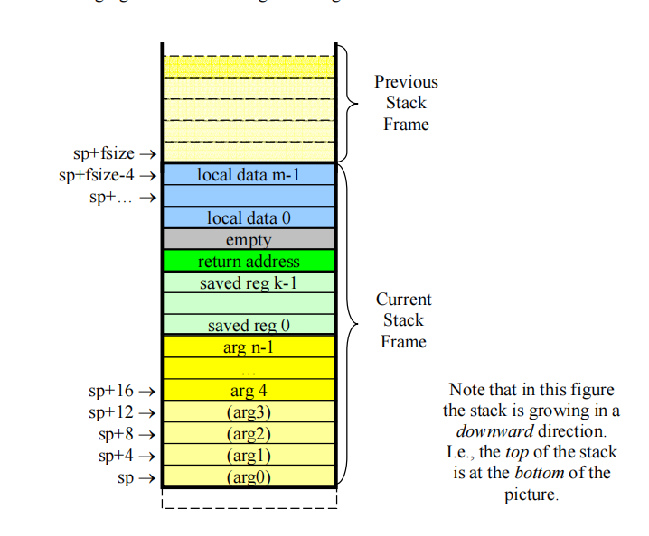
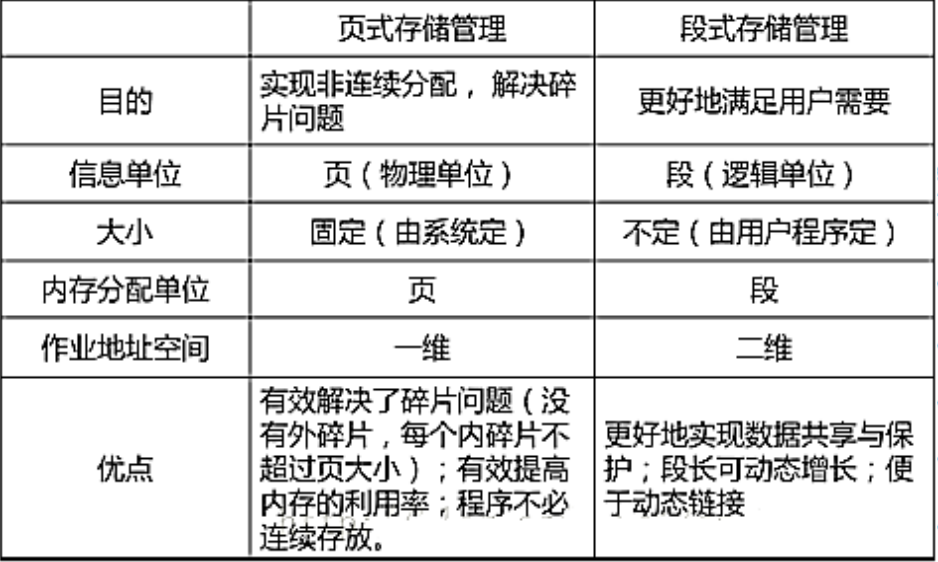

# 内存管理

## 3-1

### 存储管理的目标

* 地址独立：程序发出的地址与物理地址无关。
* 地址保护：一个程序不能访问另一个程序的地址空间。

### 存储管理的功能

* 存储分配和回收
* 地址变换
* 存储共享和保护
* 存储器扩充

### 地址空间与存储空间

* **地址空间** ：源程序经过编译后得到的目标程序，存在于它所限定的地址范围内，这个范围称为地址空间。简言之，地址空间是逻辑地址的集合。
* **存储空间** ：存储空间是指主存中一系列存储信息的物理单元的集合，这些单元的编号称为物理地址或绝对地址。简言之，存储空间是物理地址的集合。

### 多道程序的存储管理

**空间的分配：分区式分配**

把内存分为一些大小相等或不等的分区(partition)，每个应用程序占用一个或几个分区。操作系统占用其中一个分区。

#### 固定式分区

把内存划分为若干个固定大小的连续分区。

* 优点：易于实现，开销小，无外碎片
* 缺点：产生内碎片造成浪费，分区总数固定限制并发执行的程序数目
* 管理所用数据结构：分区表——记录分区的大小及使用情况

#### 可变式分区

分区的边界可以移动，即分区的大小可变。

* 优点：没有内碎片
* 缺点：有外碎片

#### 内碎片和外碎片

**内碎片：**

* 指分配给作业的存储空间中未被利用的部分。
* 单一连续区存储管理和固定分区存储管理都会产生内碎片。
* 内部碎片无法被整理，但作业完成后会得到释放。它们其实已经被分配出去了，只是没有被利用。

**外碎片：**

* 指系统中无法利用的小的空闲分区。如分区与分区之间存在的碎片。这些不连续的区间就是外部碎片。动态分区管理会产生外部碎片。
* 外部碎片才是造成内存系统性能下降的主要原因。外部碎片可以被整理后清除。
* 消除外部碎片的方法：紧凑技术。
* 紧凑技术：通过移动已分配的内存块，将所有空闲空间合并成一个大的连续块。 就像把拼图碎片重新排列，使它们形成一个完整的图案。

### 闲置空间的管理

分为 **位图表示法** 和 **链表表示法**

* 位图表示法：给每个分配单元赋予一个字位，用来记录该分配单元是否闲置。

  * 空间成本固定：不依赖于内存中的程序数量。
  * 时间成本低：操作简单，直接修改其位图值即可。
  * 没有容错能力：如果一个分配单元为1，不能肯定应该为1还是因错误变成1。
* 链表表示法：将分配单元按照是否闲置链接起来。

  * 空间成本：取决于程序的数量。
  * 时间成本高：遍历链表耗时，还要进行链表项的增删改查。
  * 有一定容错能力：因为链表有被占空间和闲置空间的表项，可以相互验证。

### 分区分配——基于顺序搜索的分配算法：

* 首次适应算法（First Fit）：每个空白区按其在存储空间中地址递增的顺序连在一起，在为作业分配存储区域时，从这个空白区域链的始端开始查找，选择第一个足以满足请求的空白块。
* 下次适应算法（Next Fit）：把存储空间中空白区构成一个循环链，每次为存储请求查找合适的分区时，总是从上次查找结束的地方开始，只要找到一个足够大的空白区，就将它划分后分配出去。
* 最佳适应算法（Best Fit）：为一个作业选择分区时，总是寻找其大小最接近于作业所要求的存储区域。
* 最坏适应算法（Worst Fit）：为作业选择存储区域时，总是寻找最大的空白区。

### 伙伴系统

伙伴：在分配存储块时将一个大的存储块分裂成两个大小相等的小块，这两个小块称为“伙伴” 。

* 伙伴系统内存分配

* 伙伴系统内存回收

## 3-2

### 存储分配的三种方式

#### 直接指定方式

编程或在汇编、编译程序时直接使用实际地址。

#### 静态分配

编程时或由编译程序产生的目的程序,均可从其地址空间的零地址开始；当装配程序对其进行链接装入时才确定它们在主存中的地址。

#### 动态分配

作业在存储空间中的位置,在其装入时确定,在其执行过程中可根据需要申请附加的存储空间,而且一个作业已占用的部分区域不再需要时,可以要求归还给系统。

### 程序段

一个程序主要由bss、data、text三个段组成

C语言之类的程序编译完成后——

* bss：程序中未初始化的全局和静态变量（静态内存分配）
* data：程序中已初始化的全局和静态变量（静态内存分配）
* text：程序执行代码（静态内存分配）

### 栈和堆

* 栈：存放局部变量、保存/恢复调用现场
* 堆：动态分配内存段如 `malloc`所分配的内存

### MIPS栈帧

In general, the stack frame for a subroutine may contain space to contain the following:

* Space to store arguments passed to subroutines that this subroutine calls.

* A place to store the values of saved registers ($s0 to $s7).
* A place to store the subroutine’s return address ($ra).
* A place for local data storage.

### Linux下可执行文件格式

* **ELF**

分为三类：可重定位文件、可执行文件、共享文件

ELF结构见实验指导书学习Lab1

## 3-3

页表基础见指导书学习Lab2

### 反置页表

反置页表不是依据进程的逻辑页号来组织，而是依据该进程在内存中的物理页面号来组织，其表项的内容是逻辑页号 P 及隶属进程标志符 pid 。

反置页表的大小只与物理内存的大小相关，与逻辑空间大小和进程数无关。如: 64MB主存,若页面大小为 4kB,则反向页表只需 64kB。

**反置页表的地址变换**

利用进程号和页号检索页表；

若遍历后未检索到则产生请求调页中断；

若检索到则该表项的索引号就是该页的物理页号。

* 性能改进：哈希页表

## 3-4

### 段式存储管理

由于段式存储管理是逻辑连续的，故方便共享。

#### 可重入代码

可重入代码是一种允许多个进程同时访问的代码。为使各个进程所执行的代码完全相同，绝对不允许可重入代码在执行中有任何改变。因此，可重入代码是一种不允许任何进程对它进行修改的代码。

#### 分页与分段的区别

## 3-5

虚拟内存基础知识，同上学期计组

## 3-6

页置换算法

### Belady现象

在使用FIFO算法作为缺页置换算法时，分配的页面增多，但缺页率反而提高，这样的异常现象称为Belady Anomaly。

### 缺页置换算法

* FIFO：先进先出
* 二次机会：每个页面会增加一个访问标志位，用于标识数据放入缓存队列后是否被再次访问过。若标识位有效，则在淘汰时再给其一次机会并将标识位置0
* Clock：构建循环链表，初始指针指向最早装入的页面，产生缺页错误时，若该页面被访问过则清楚访问表示，先后遍历链表，直至找到一个访问标识位无效的页面，进行替换，并把指针指向下一个页面。
* LRU：最近最少使用，同上学期计组
* 老化算法：老化算法是LRU的简化，但性能接近LRU——为每个页面设置一个移位寄存器，并设置一位访问位R，每隔一段时间，所有寄存器右移1位，并将R值从左移入。

### 工作集和驻留集管理

* 工作集：当前正在使用的页面的集合
* 驻留集：虚拟内存系统中每个进程驻留在内存的页面集合，或进程分到的物理页框集合

## 3-7

页目录自映射

多级页表基础见实验指导书学习Lab2

### 构建页目录自映射

页目录在哪？

* 给定页表虚拟地址起始位置，例如0x7fc00000
* 可知，从这个地址开始的4MB是存储页表的空间
* 这4MB地址空间是整个4GB地址空间中第（0x7fc00000>>22）个4MB地址空间，因此其逻辑-物理映射关系应该记录在第（0x7fc00000>>22）个页表页中。

第二种理解

给定页表虚拟地址起始位置，例如0x7fc00000

* 将整个4GB地址空间划分为1M个4KB页
* 上述地址对应于第（0x7fc00000>>12）个4KB页，因此其逻辑-物理映射关系应该记录在第（0x7fc00000>>12）个页表项中
* 每个页表项址偏移为（0x7fc00000>>12个字节，所以该页表项对于的地）*4 = 0x1ff000
