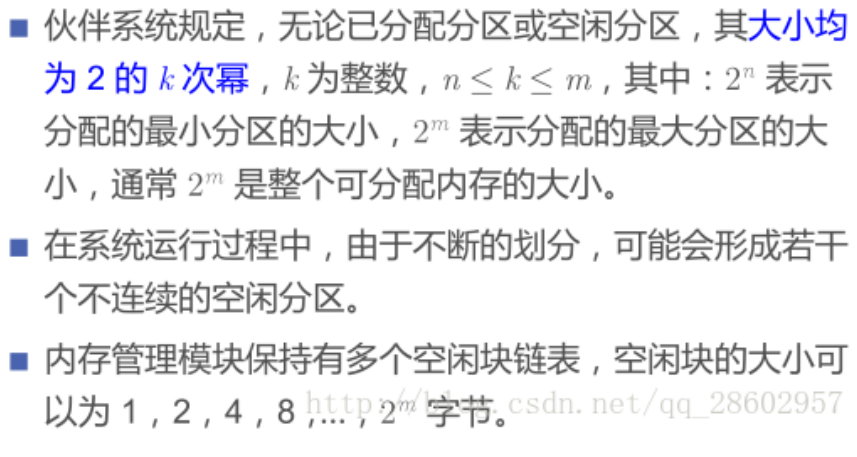
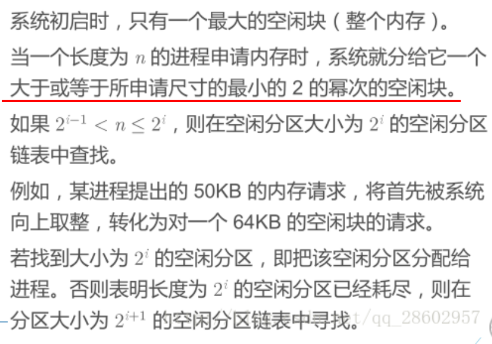
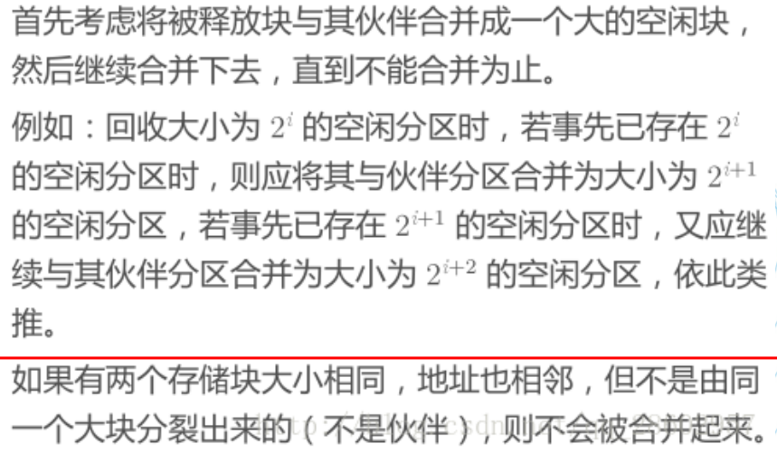
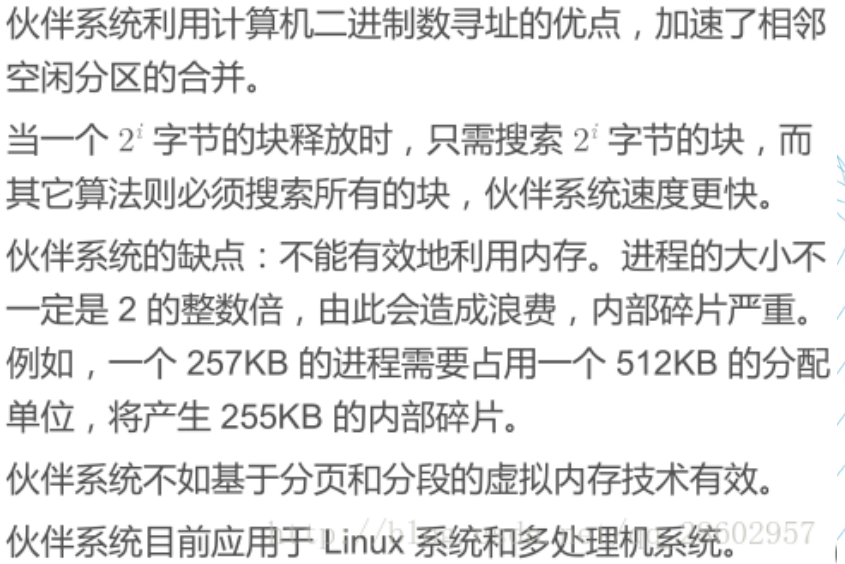

# 内存管理

## 3-1

### 存储管理的目标

* 地址独立：程序发出的地址与物理地址无关。
* 地址保护：一个程序不能访问另一个程序的地址空间。

### 存储管理的功能

* 存储分配和回收
* 地址变换
* 存储共享和保护
* 存储器扩充

### 地址空间与存储空间

* **地址空间** ：源程序经过编译后得到的目标程序，存在于它所限定的地址范围内，这个范围称为地址空间。简言之，地址空间是逻辑地址的集合。
* **存储空间** ：存储空间是指主存中一系列存储信息的物理单元的集合，这些单元的编号称为物理地址或绝对地址。简言之，存储空间是物理地址的集合。

### 多道程序的存储管理

**空间的分配：分区式分配**

把内存分为一些大小相等或不等的分区(partition)，每个应用程序占用一个或几个分区。操作系统占用其中一个分区。

#### 固定式分区

把内存划分为若干个固定大小的连续分区。

* 优点：易于实现，开销小，无外碎片
* 缺点：产生内碎片造成浪费，分区总数固定限制并发执行的程序数目
* 管理所用数据结构：分区表——记录分区的大小及使用情况

#### 可变式分区

分区的边界可以移动，即分区的大小可变。

* 优点：没有内碎片
* 缺点：有外碎片

#### 内碎片和外碎片

**内碎片：**

* 指分配给作业的存储空间中未被利用的部分。
* 单一连续区存储管理和固定分区存储管理都会产生内碎片。
* 内部碎片无法被整理，但作业完成后会得到释放。它们其实已经被分配出去了，只是没有被利用。

**外碎片：**

* 指系统中无法利用的小的空闲分区。如分区与分区之间存在的碎片。这些不连续的区间就是外部碎片。动态分区管理会产生外部碎片。
* 外部碎片才是造成内存系统性能下降的主要原因。外部碎片可以被整理后清除。
* 消除外部碎片的方法：紧凑技术。
* 紧凑技术：通过移动已分配的内存块，将所有空闲空间合并成一个大的连续块。 就像把拼图碎片重新排列，使它们形成一个完整的图案。

### 闲置空间的管理

分为 **位图表示法** 和 **链表表示法**

* 位图表示法：给每个分配单元赋予一个字位，用来记录该分配单元是否闲置。

  * 空间成本固定：不依赖于内存中的程序数量。
  * 时间成本低：操作简单，直接修改其位图值即可。
  * 没有容错能力：如果一个分配单元为1，不能肯定应该为1还是因错误变成1。
* 链表表示法：将分配单元按照是否闲置链接起来。

  * 空间成本：取决于程序的数量。
  * 时间成本高：遍历链表耗时，还要进行链表项的增删改查。
  * 有一定容错能力：因为链表有被占空间和闲置空间的表项，可以相互验证。

### 分区分配——基于顺序搜索的分配算法：

* 首次适应算法（First Fit）：每个空白区按其在存储空间中地址递增的顺序连在一起，在为作业分配存储区域时，从这个空白区域链的始端开始查找，选择第一个足以满足请求的空白块。
* 下次适应算法（Next Fit）：把存储空间中空白区构成一个循环链，每次为存储请求查找合适的分区时，总是从上次查找结束的地方开始，只要找到一个足够大的空白区，就将它划分后分配出去。
* 最佳适应算法（Best Fit）：为一个作业选择分区时，总是寻找其大小最接近于作业所要求的存储区域。
* 最坏适应算法（Worst Fit）：为作业选择存储区域时，总是寻找最大的空白区。

### 伙伴系统

伙伴：在分配存储块时将一个大的存储块分裂成两个大小相等的小块，这两个小块称为“伙伴” 。

