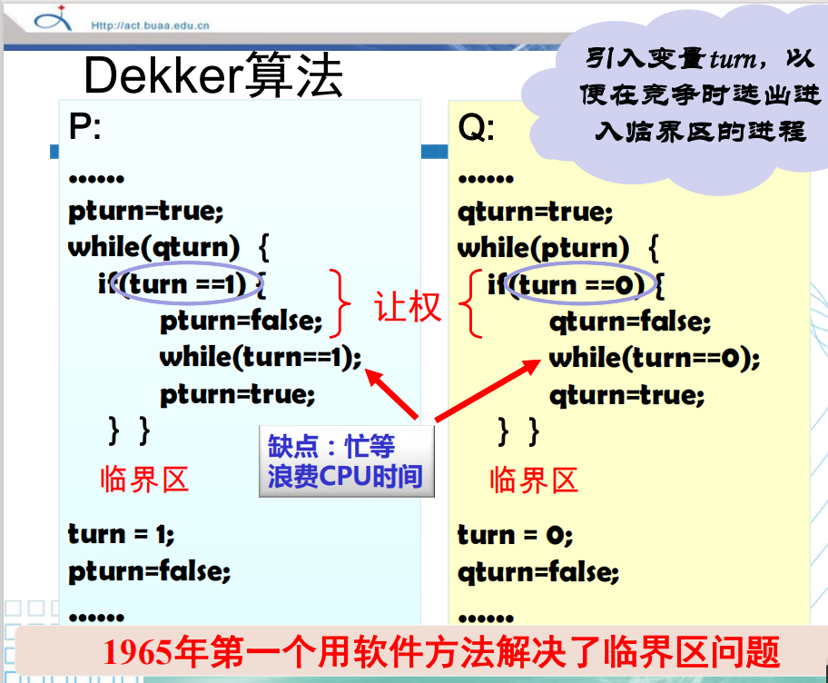
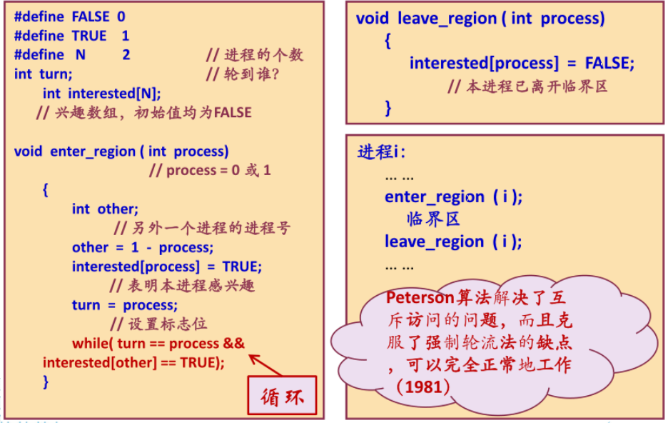
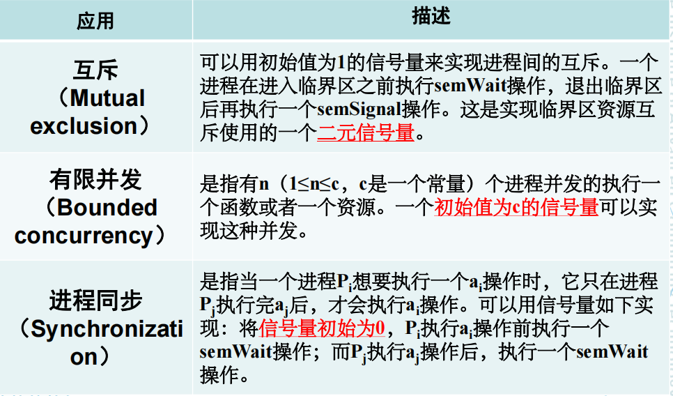

# 进程与线程

## 4-1

### 进程概念的引入

#### 进程的定义和特征

**定义：**

* 进程是程序的一次执行；
* 进程是可以和别的计算并发执行的计算；
* 进程可定义为一个数据结构，及能在其上进行操作的一个程序；
* 进程是一个程序及其数据，在处理机上顺序执行时所发生的活动；
* 进程是程序在一个数据集合上运行的过程，它是系统进行资源分配和调度的一个独立单位。

**特征：**

* 动态性：进程是程序的一次执行过程。动态性还表现为它因创建而产生，因调度而执行，因无资源而暂停，因撤消而消亡。而程序是静态实体。
* 并发性：多个进程实体同时存在于内存中，能在一段时间内同时运行。
* 独立性：在传统OS中，进程是独立运行的基本单位。
* 异步性：也叫制约性，进程之间相互制约，进程以各自独立的不可预知的速度向前推进。

**结构特征：**

* 程序段，数据段，进程控制块PCB

#### 并发与并行

* **并发**： 设有两个活动 **a1** 和 **a2** ，如果在某一指定的时间t，无论 **a1** 和 **a2** 是在同一处理机上还是在不同的处理机上执行，只要 **a1** 和 **a2** 都处在各自的起点和终点之间的某一处，则称 **a1** 和 **a2** 是并发执行的。
* **并行：** 如果考虑两个程序,它们在同一时间度量下同时运行在不同的处理机上，则称这两个程序是并行执行的。
* 并发可能是伪并行，也可能是真并行。

#### 程序并发时的特征

* 间断性：并发程序具有“执行——暂停——执行”的间断性活动规律。
* 非封闭性：多个程序共享系统中的资源，这些资源的状态将由多个程序来改变，致使程序之间相互影响。
* 不可再现性：在初始条件相同的情况下，程序的执行结果依赖于执行的次序。

#### 并行程序的竞争

* 竞争：多个进程在读写一个共享数据时结果依赖于它们执行的相对时间，这种情形叫做竞争。
* 竞争条件（Race Condition）：多个进程并发访问和操作同一数据且执行结果与访问的特定顺序有关，称为竞争（发生）条件。

#### 并行性的确定－Bernstein条件

* `R(Si)`：`Si`的读子集, 其值为在 `Si`中被引用的变量的集合
* `W(Si)`：`Si`的写子集, 其值在 `Si`中被改变的变量的集合

Bernstein条件：

* R(S1) ∩ W(S2) = Φ
* W(S1) ∩ R(S2) = Φ
* W(S1) ∩ W(S2) = Φ

### 进程控制

进程控制的主要任务是创建和撤消进程以及实现进程的状态转换。

**由内核实现！**

#### 进程控制的实现：原语

原语：由若干条指令所组成的指令序列，来实现某个特定的操作功能

* 指令序列执行是连续的，不可分割
* 是操作系统核心组成部分
* 必须在管态（内核态）下执行，且常驻内存

#### Fork（）函数

在语句fpid=fork()之前，只有一个进程在执行这段代码，但在这条语句之后，就变成两个进程在执行了。

在fork函数执行完毕后，如果创建新进程成功，则出现两个进程，一个是子进程，一个是父进程。在子进程中，fork函数返回0，在父进程中，fork返回新创建子进程的进程ID。我们可以通过fork返回的值来判断当前进程是子进程还是父进程。

fpid的值为什么在父子进程中不同。其实就相当于链表，进程形成了链表，父进程的fpid指向子进程的进程id, 因为子进程没有子进程，所以其fpid为0。

#### 进程状态机器演变

进程的三种状态

* 就绪状态：已经获得除处理机外的所需资源，等待分配处理机资源（只需分配CPU即可执行）
* 执行状态：占用处理机资源。处于此状态的进程的数目小于等于CPU数目。
  * 在没有其他进程可以执行时（如所有进程都在阻塞状态），通常会自动执行系统的idle进程（相当于空操作）。
* 阻塞状态：正在执行的进程，由于发生某种事件而暂时无法执行，便放弃处理机处于暂停状态。

#### 进程控制块PCB

作用：

* 进程创建和撤销
* 进程唯一标志
* 限制系统进程数目

内容：

进程标识符、程序和数据地址、现行状态、现场保留区、互斥和同步机制、进程通信机制、优先级、资源清单、链接字、家族关系...

### 线程概念引入

* 进程是资源分配的基本单位，线程是处理机调度的基本单位，所有的线程共享其所属进程的所有资源与代码。
* 线程执行过程之中很容易进行协作同步，而进程需要通过消息通信进行同步。
* 线程共享进程的数据的同时，有自己私有的的堆栈。
* 线程不能单独执行，但是每一个线程都有程序的入口、执行序列以及程序出口。它必须组成进程才能被执行。

### 线程的实现

用户级线程、系统级线程、混合实现

* 混合实现：将用户级进程映射到内核级线程

## 4-2

### 程序的并发执行

#### 资源竞争

* 临界资源：一次仅仅允许一个进程访问的资源
* 临界区：每个进程中访问临界资源的那段代码

#### 同步与互斥

* 进程互斥：两个或两个以上的进程，不能同时进入关于同一组共享变量的临界区域，否则可能发生与时间有关的错误。是进程间发生的一种间接性作用。
* 进程互斥：系统中各进程之间能有效地共享资源和相互合作，从而使程序的执行具有可再现性的过程。是进程间的一种刻意安排的直接制约关系。即为完成同一个任务的各进程之间，因需要协调它们的工作而相互等待、相互交换信息所产生的制约关系。
* 互斥：某一资源同时只允许一个访问者对其进行访问，具有唯一性和排它性。互斥无法限制访问者对资源的访问顺序，即访问是无序访问。
* 是指在互斥的基础上（大多数情况），通过其它机制实现访问者对资源的有序访问。在大多数情况下，同步已经实现了互斥，特别是所有对资源的写入的情况必定是互斥的。少数情况是指可以允许多个访问者同时访问资源。

#### 互斥设计准则

* 空闲让进
* 忙则等待
* 有限等待
* 让权等待

### 基于忙等待的互斥方法（软件）

#### Dekker算法



存在问题：

内层while循环会导致CPU忙等，浪费CPU时间。

#### Peterson算法



#### Bakery算法

```c
Entry Section (i) { // i  process i
	while (true) {
		Choosing[i] = 1;
		Number[i] = 1 + max(Number[1],...,Number[N]);
		Choosing [i] = 0;
		for (j=1; j＜=N; ++j) {
			while (Choosing[j] != 0) { }
			// wait until process j receives its number
			while ((Number[j]!=0) && ((Number[j],j) ＜ (Number[i],i))) { }
			// wait until processes with smaller numbers, or with the 
			// same number, but with higher priority, finish their work
		}
		// critical section...
		Number[i] = 0;
		// non-critical section...
	}
}
```

### 基于忙等待的互斥方法（硬件）

* 中断屏蔽
* `Spinlocks`自旋锁方法（结合使用 `test-and-set`指令）
* 使用 `swap`指令

### 基于忙等待的互斥方法总结

[CSDN一篇讲的很好的文章](https://blog.csdn.net/m0_48241022/article/details/142315009)

* 共性问题：

  * 忙等待：浪费CPU时间
  * 优先级反转：低优先级进程先进入临界区，高优先级进程一直忙等

## 4-3

### 信号量

信号量是一个和队列有关的变量

**经典信号量** 有两个原语

```c
P(S): while S<=0 do skip
	S:=S-1;

V(S): S:=S+1;
```

`P(S)`用来申请资源，`V(S)`用来释放资源。

对于 **计数信号量机制** ，利用阻塞解决了忙等待问题，以下是伪代码

```c
Type semaphore = record
	value : integer;
	L : list of process;
end

Procedure P(S)
	var S : semaphore;
	begin 
		S.value := S.value -1;
		if S.value<0 then block(S.L);
	end

procedure V(S)
	var S : semaphore;
	begin
		S.value := S.value + 1;
	if S.value<=0 then wakeup(S.L)
	end
```

#### 信号量的使用

* 必须置一次且只能置一次初始值
* 智能由P、V操作来改变

#### 信号量物理意义

* S.value为正时表示资源的个数
* S.value为负时表示等待进程的个数
* P操作分配资源
  * 如果无法分配则阻塞（wait）
* V操作释放资源
  * 如果有等待进程则唤醒（signal）

#### 信号量在并发中的应用



### 管程

#### 管程引入

* 一个管程是由过程、变量及数据结构等组成的一个集合，它们组成一个特殊的模块或者软件包。
* 互斥：任一时刻，管程中只能有一个活跃进程。

#### 管程实现

* 局部控制变量（临界资源）：一组局部于管程的控制变量
* 初始化代码：对控制变量进行初始化的代码
* 操作原语（互斥）：对控制变量和临界资源进行操作的一组原语过程（程序代码），是访问该管程的唯一途径。
* 条件变量（同步）：每个独立的条件变量是和进程需要等待的某种原因相联系的，当定义一个条件变量x时，系统就建立一个相应的等待队列。

#### 管程互斥实现

* 入口等待队列
* 紧急等待队列：signal（）唤醒后将等待者放在此队尾。

### 进程间通信

#### 无名管道

只能用于父子进程或者兄弟进程之间；

单独构成一种独立的文件系统，并且只存在于内存中。

#### 有名管道和FIFO

能被所有线程访问

#### 消息传递

两个原语：

* send(destination, &message)
* receive(source, &message)

#### 共享内存

共享内存是最有用的进程间通信方式，也是最快的IPC形式（因为它避免了其它形式的IPC必须执行的开销巨大的缓冲复制）。

## 4-4
